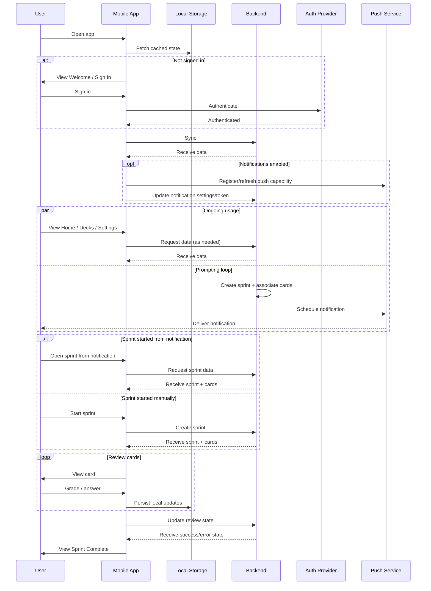
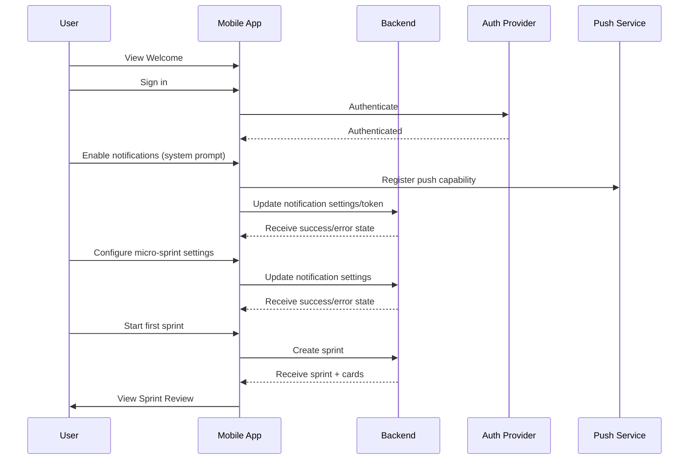
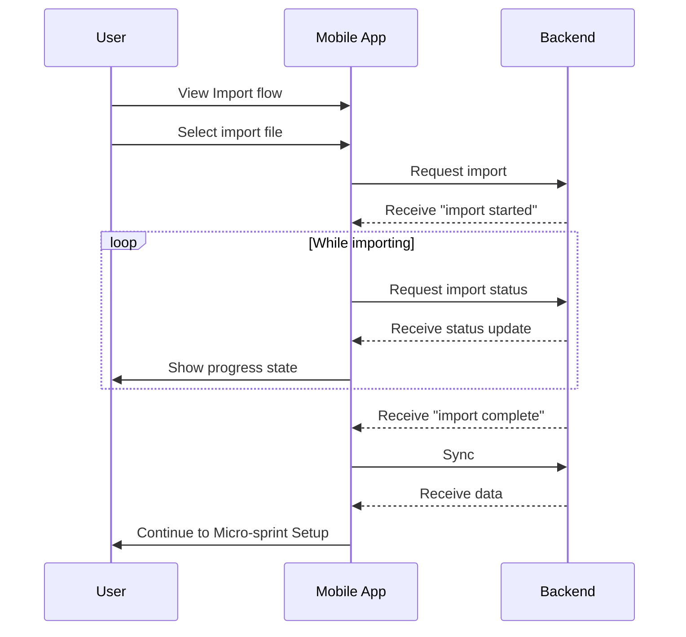
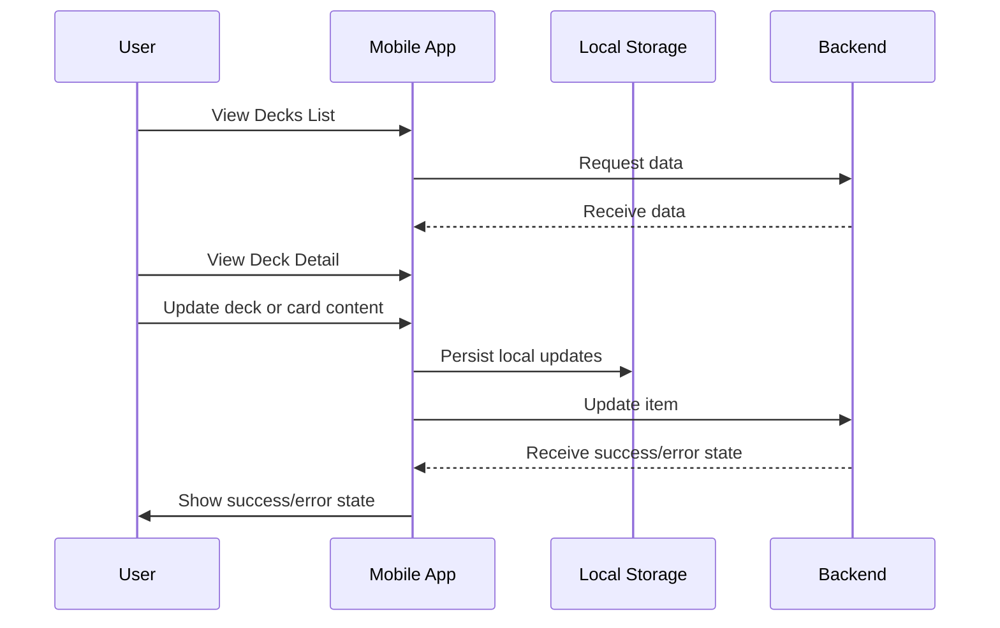
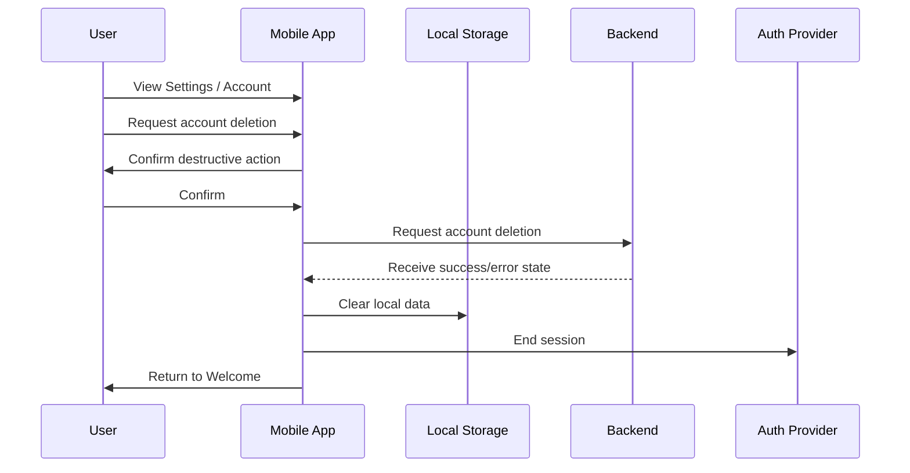
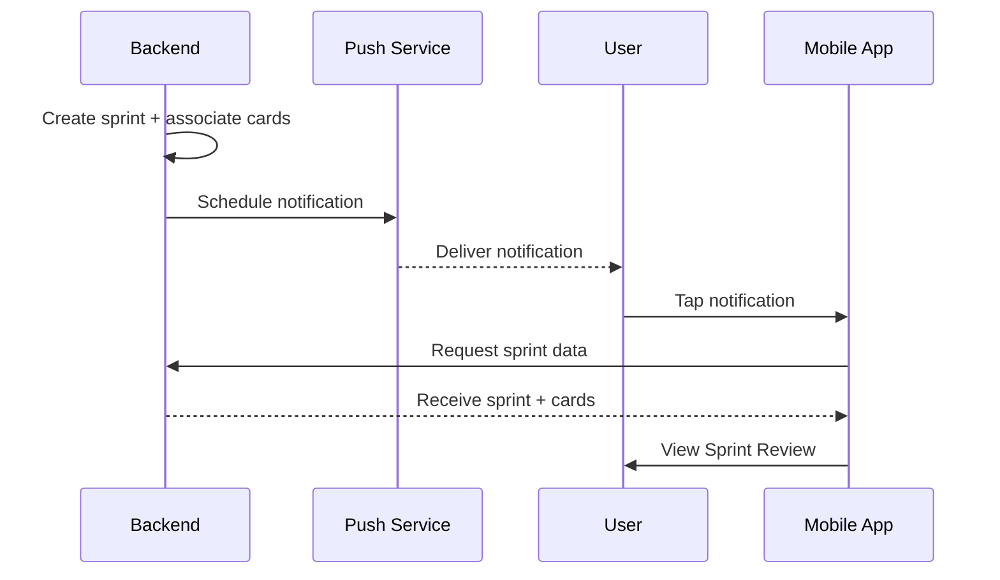
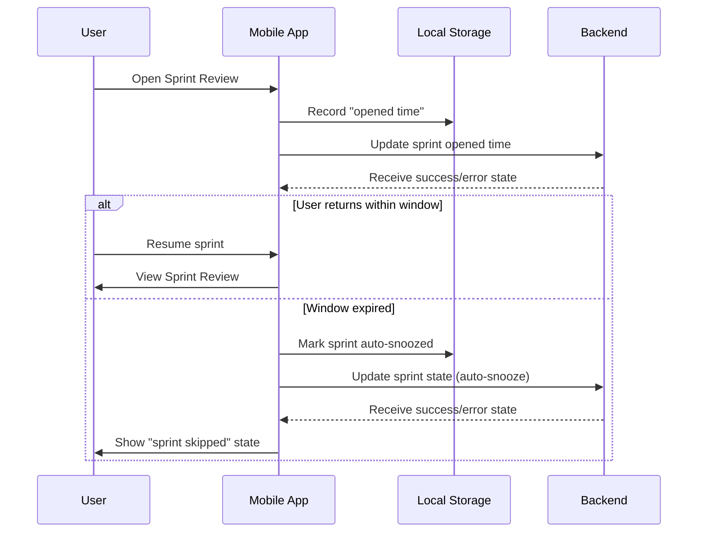
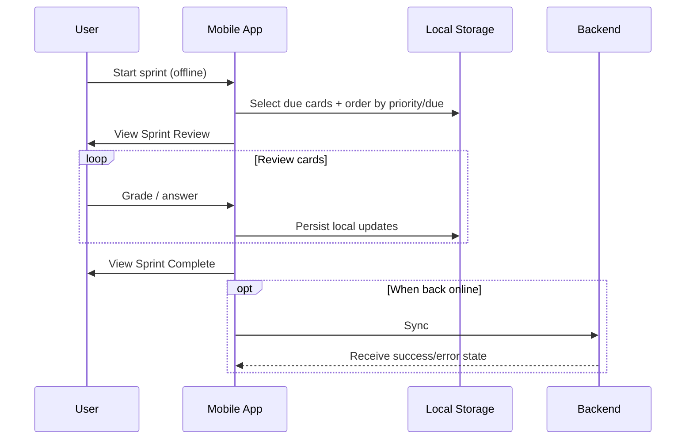

Sequence Diagram Pack (High-Level)

1) Overall app sequence

2) Core screens sequences
- Onboarding (start fresh)

- Onboarding (import)

- Deck detail + card editor

- Settings + delete account

3) Core features sequences
- Notification-driven micro-sprint (server creates sprint before notify)

- Resumable sprint + auto-snooze (30-minute window)

- Offline manual sprint + later sync

